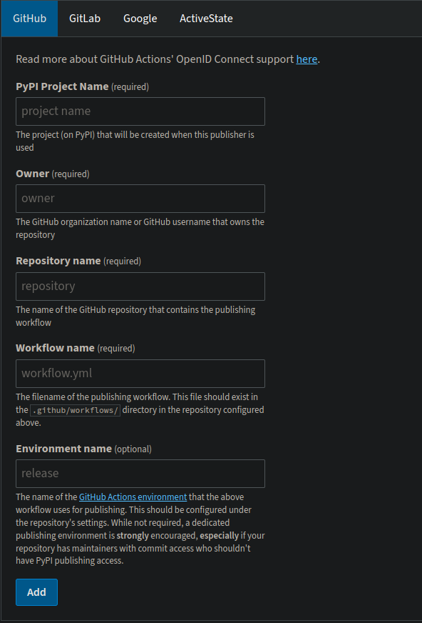

## Pushing tags
git tag v0.x.x
git push origin tag v0.x.x

## Github actions locally with act https://nektosact.com/installation/gh.html
```
# .env
TEST_PYPI_API_TOKEN=pypi-******
```
```
gh act --secret-file .env -W .github/workflows/publish-pypi.yml
```
## Settting up a project in pypi https://pypi.org/manage/account/publishing/


## Credentials
```
# ~/.pypirc
[pypi]
    repository = https://upload.pypi.org/legacy/
    username = __token__
    password = pypi-*********
[testpypi]
    repository = https://test.pypi.org/legacy/
    username = __token__
    password = pypi-*********
```

python workflows
https://github.com/search?q=repo%3Aactions%2Fstarter-workflows+Python+path%3A*.yml+OR+path%3A*.yaml&type=code

https://github.com/YoraiLevi/pip_installable_module/actions/new?category=none&query=python